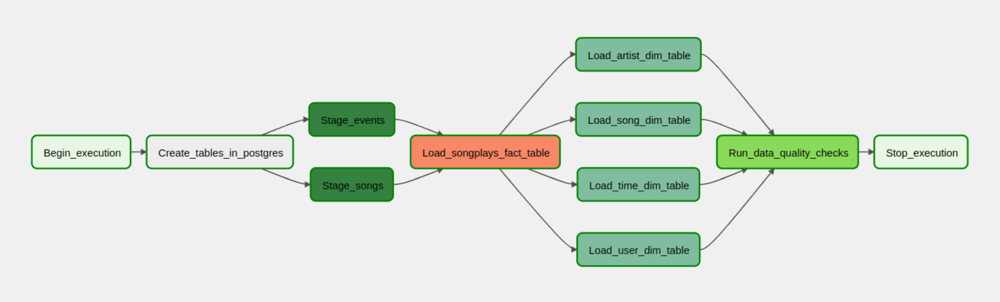
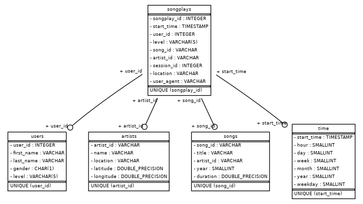

# Project: Data Warehouse

## Introduction
A music streaming company, Sparkify, has decided that it is time to introduce more automation and monitoring to their data warehouse ETL pipelines and come to the conclusion that the best tool to achieve this is Apache Airflow.

They have decided to bring you into the project and expect you to create high grade data pipelines that are dynamic and built from reusable tasks, can be monitored, and allow easy backfills. They have also noted that the data quality plays a big part when analyses are executed on top the data warehouse and want to run tests against their datasets after the ETL steps have been executed to catch any discrepancies in the datasets.

The source data resides in S3 and needs to be processed in Sparkify's data warehouse in Amazon Redshift. The source datasets consist of JSON logs that tell about user activity in the application and JSON metadata about the songs the users listen to.

---

## Project Description

In this Project an ETL Pipeline is implemented, which 
1. Creating the tables in the Redshift database if not exist
2. copying from staging the data into redshift
3. load the data from the staging into fact-table
4. load the data from the staging into dimension-table
5. run the data quality checks




---

## Project Structure

```
.
├── assets : static files
├── create_tables.py : script to create the tables
├── dwh.cfg.template : template file to genereate the config files
├── etl.py : script to execute the ETL pipeline
├── infra : terraform folder to deploy the infrastructure
├── README.md : project description
├── requirements.txt : list of all dependencies
├── sql_queries.py : define the queries to be executed
├── sync_secrets.py : script to sync the secrets from the AWS Secrets Manager to the local config files
```

---

## Project Datasets
There are the S3 links for each:

- Song data: `s3://udacity-dend/song_data`
- Log data: `s3://udacity-dend/log_data`

Log data json path: `s3://udacity-dend/log_json_path.json`

### Song Dataset

The first dataset is a subset of real data from the [Million Song Dataset](https://labrosa.ee.columbia.edu/millionsong/)
. Each file is in JSON format and contains metadata about a song and the artist of that song. The files are partitioned
by the first three letters of each song's track ID. For example, here are filepaths to two files in this dataset.

```
song_data/A/B/C/TRABCEI128F424C983.json
song_data/A/A/B/TRAABJL12903CDCF1A.json
```

And below is an example of what a single song file, TRAABJL12903CDCF1A.json, looks like.

```json
{
  "num_songs": 1,
  "artist_id": "ARJIE2Y1187B994AB7",
  "artist_latitude": null,
  "artist_longitude": null,
  "artist_location": "",
  "artist_name": "Line Renaud",
  "song_id": "SOUPIRU12A6D4FA1E1",
  "title": "Der Kleine Dompfaff",
  "duration": 152.92036,
  "year": 0
}
```


### Log Dataset

The second dataset consists of log files in JSON format generated by
this [event simulator](https://github.com/Interana/eventsim) based on the songs in the dataset above. These simulate app
activity logs from an imaginary music streaming app based on configuration settings.

The log files in the dataset are partitioned by year and month. For example, here are filepaths
to two files in this dataset.

``
log_data/2018/11/2018-11-12-events.json log_data/2018/11/2018-11-13-events.json
``

**Example**

```json
{
  "artist": "Muse",
  "auth": "Logged In",
  "firstName": "Harper",
  "gender": "M",
  "itemInSession": 1,
  "lastName": "Barrett",
  "length": 209.50159,
  "level": "paid",
  "location": "New York-Newark-Jersey City, NY-NJ-PA",
  "method": "PUT",
  "page": "NextSong",
  "registration": 1540685364796,
  "sessionId": 275,
  "song": "Supermassive Black Hole (Twilight Soundtrack Version)",
  "status": 200,
  "ts": 1541721977796,
  "userAgent": "\"Mozilla/5.0 (Windows NT 6.3; WOW64) AppleWebKit/537.36 (KHTML, like Gecko) Chrome/36.0.1985.143 Safari/537.36\"",
  "userId": "42"
}
```
---

## Star Schema (Data Catalog)
The star schema is chosen because it is optimized for querying the user's behaviour.

The goal to be achieved with the star schema is to optimize queries on song play analysis.

Following is the ERD of the star schema:

### Fact Table

#### songplays table

This tables contains the song play events in the log data.

| Column Name | Type       | Example                            |
|-------------|------------|------------------------------------|
| songplay_id | IDENTITY   | 1210                               |
| start_time  | TIMESTAMP  | 2018-11-21 21:56:47.796000         |
| user_id     | INT        | 15                                 |
| level       | VARCHAR(5) | paid                               |
| song_id     | VARCHAR    | SOZCTXZ12AB0182364                 |
| artist_id   | VARCHAR    | AR5KOSW1187FB35FF4                 |
| session_id  | INT        | 818                                |
| location    | VARCHAR    | Chicago-Naperville-Elgin, IL-IN-WI |
| user_agent  | VARCHAR    | "Mozilla/5.0 (X11; .."             |

---

### Dimension Table

#### songs table

This table contains the songs from the music dataset.

| Column Name | Type     | Example              |
|-------------|----------|----------------------|
| song_id     | VARCHAR  | SOGVQGJ12AB017F169   |
| title       | VARCHAR  | Ten Tonne            |
| artist_id   | VARCHAR  | AR62SOJ1187FB47BB5   |
| year        | SMALLINT | 2005                 |
| duration    | FLOAT    | 337.68444            |

---

#### artist table

This tables contains the artist from music dataset.

| Column Name | Type    | Example                 |
|-------------|---------|-------------------------|
| artist_id   | VARCHAR | AR0IAWL1187B9A96D0      |
| name        | VARCHAR | Danilo Perez            |
| location    | VARCHAR | Panama                  |
| latitude    | FLOAT   | 8.4177                  |
| longitude   | FLOAT   | -80.11278               |

---

#### time table

This tables contains timestamps of records in **songplays** broken down into specific units.

| Column Name | Type      | Example                    |
|-------------|-----------|----------------------------|
| start_time  | TIMESTAMP | 2018-11-17 00:02:24.796000 |
| hour        | SMALLINT  | 0                          |
| day         | SMALLINT  | 17                         |
| week        | SMALLINT  | 46                         |
| month       | SMALLINT  | 11                         |
| year        | SMALLINT  | 2018                       |
| weekday     | SMALLINT  | 5                          |

---

## Infrastructure

For this project, I'll be using Amazon Web Services (AWS) to store data and run ETL pipelines. You'll be using the following services:
- IAMRole
- Redshift
- S3

### Prerequisites:
To generate the infrastructure, I'll be using the [Terraform](https://www.terraform.io/) tool.

1. Make sure that aws profile in `~/.aws/credentials` is set to `udacity`.
2. [Terraform cloud](https://cloud.hashicorp.com/products/terraform) are used to save the remote state. 
   Local teraform state could be used as well. Just replace the cloud attribute with `local` in `infra/main.tf` file. 

### Creating the infrastructure
```bash
cd infra/
terraform init
terrafrom apply
```
---
## Installing Airflow
Installing `airflow 2.2.4` and its packages to **ease the development** locally.
```bash
export AIRFLOW_VERSION=2.2.4
export PYTHON_VERSION="$(python --version | cut -d " " -f 2 | cut -d "." -f 1-2)"
export CONSTRAINT_URL="https://raw.githubusercontent.com/apache/airflow/constraints-${AIRFLOW_VERSION}/constraints-${PYTHON_VERSION}.txt"
pip install "apache-airflow[postgres,amazon]==${AIRFLOW_VERSION}" --constraint "${CONSTRAINT_URL}"
```

## Run Airflow
1. Fillout `.env` file with all necessary environment variable. It could be done in 2 ways:
   1. By creating infrastructure yourself and sync secrets to your local machine.
      - Make sure `~/.aws/credentials` is set to `udacity`, otherwise change the variable `AWS_PROFILE` in `sync_secret.py`
      - Run sync_secret.py to sync the AWS secrets to the `.env` file. (It will generate automatically)
   2. By filling out manually with following template in `.env`file:
    ```bash
    AIRFLOW_CONN_REDSHIFT_CONN_ID=<<FILL ME>>
    AIRFLOW_VAR_REDSHIFT_IAM_ARN=<FILL ME>
    ```

2. Run airflow with `docker-compose up` command.
    ```bash
    docker-compose up -d
    ```


- Login to Airflow UI: http://localhost:8080
  - User: airflow
  - Password: airflow